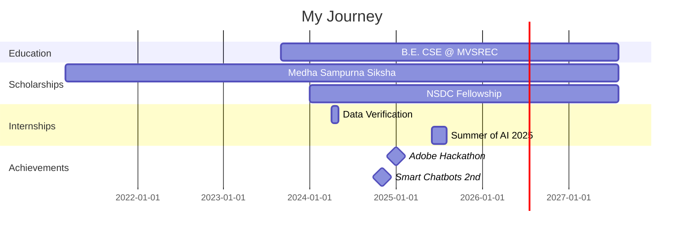

  

  
  

### 🚀 About Me

- 🎓 **B.E. in Computer Science** @ MVSREC | CGPA: **9.47/10**
- 🏆 **Top 4000** out of 100,000+ in Adobe India Hackathon 2025
- 💡 Building **AI-powered solutions** for real-world problems
- 🌱 Contributing to **open-source Telugu LLM** development
- 🎯 **2nd Place** in Smart Chatbots Competition (Nov 2024)
- 📚 **Medha Sampurna Siksha Scholar** (6-year scholarship)
- 🌐 **SheFi Scholar Season 14** - Web3 Education Program
- 🔭 Currently learning **React Native** and **Cloud Technologies**
- 💬 Ask me about **Full Stack Development, AI, and Data Science**

 

## 🛠️ Tech Stack & Tools

### 💻 Languages

  
  
  
  
  

### 🎨 Frontend Development

  
  
  

### ⚙️ Backend & Database

  
  
  

### 🤖 AI & Data Science

  
  

### 🔧 Tools & Platforms

  
  

## 🌟 Featured Projects

<table>
<tr>
<td width="50%">
<h3 align="center">Indian Cultural Heritage Explorer</h3>

  

 
 

  

<strong>Python, Streamlit, Snowflake, Gemini 2.0, Folium, Plotly</strong> - AI-powered platform promoting India's cultural heritage with interactive visualizations and Bharat Bot chatbot

</td>

<td width="50%">
<h3 align="center">MediScan</h3>

  

 
 

  

<strong>Node.js, Express.js, MySQL, Docker, LibreTranslate API</strong> - QR-based medicine information system with real-time language translation

</td>
</tr>
</table>

## 📊 GitHub Statistics

  
  

  
  

  

## 🏆 Achievements & Certifications

<table>
<tr>
<td align="center" width="33%">

 <strong>Adobe Hackathon 2025</strong>
 Top 4000/100,000+ 
</td>
<td align="center" width="33%">

 <strong>Smart Chatbots</strong>
 2nd Place (Nov 2024)
</td>
<td align="center" width="33%">

 <strong>NPTEL C Programming</strong>
 Silver Badge - Top 5%
</td>
</tr>
<tr>
<td align="center" width="33%">

 <strong>Medha Scholar</strong>
 6-year Scholarship
</td>
<td align="center" width="33%">

 <strong>SheFi Scholar S14</strong>
 Web3 Education
</td>
<td align="center" width="33%">

 <strong>Summer of AI 2025</strong>
 Open Source LLM
</td>
</tr>
</table>

## 💼 Experience Timeline

## 📫 Let's Connect

  

## 💭 Dev Quote

## 🐍 Contribution Snake

  
### 💡 *"Code is like humor. When you have to explain it, it's bad."* – Cory House

### Show some ❤️ by starring some of my repositories!

